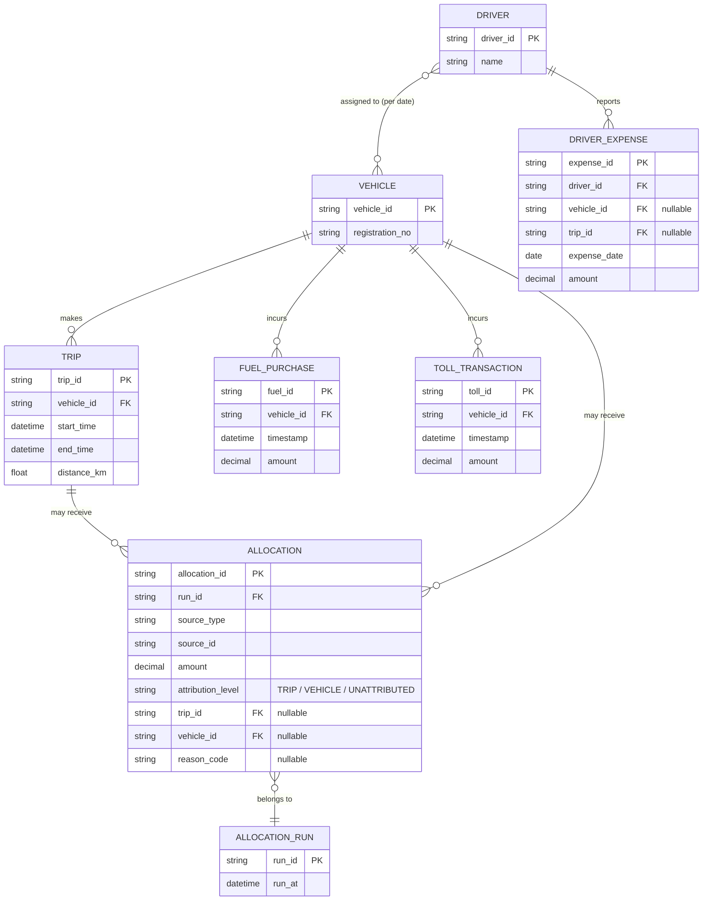
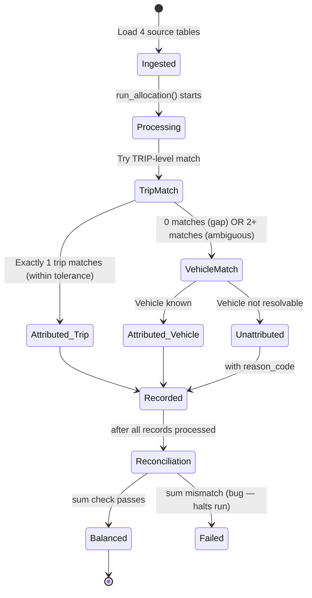

# Architecture.md — Vehicle Trip Cost Allocation

## 1. System Architecture — Monolithic, Layered Structure

This project is built as a **single deployable service (monolith)** — not
microservices. For a scoped exercise with one clear domain (cost allocation),
splitting into separate services would add deployment/networking complexity without
any real benefit — there's no independent scaling or team-ownership need here that
would justify it. Inside that single service, responsibilities are still cleanly
**layered**, so the code stays organized and testable even though it deploys as one
unit:

```
Request
   │
   ▼
┌─────────────────────────────────────────────┐
│  API Routes (FastAPI)                        │  ← defines endpoints, request/response
│  e.g. GET /costs/trip/{id}                   │    schemas (Pydantic models)
└───────────────────┬───────────────────────────┘
                     ▼
┌─────────────────────────────────────────────┐
│  Controllers                                  │  ← receives the validated request,
│  (thin — orchestrates, no business logic)    │    calls the right service, shapes
└───────────────────┬───────────────────────────┘    the response
                     ▼
┌─────────────────────────────────────────────┐
│  Services (Business Logic)                    │  ← the actual allocation policies,
│  - AllocationService                          │    reconciliation logic, query logic
│  - QueryService (cost-per-trip/vehicle)      │    live here. This is where the real
│  - ReconciliationService                     │    "thinking" of the system happens.
└───────────────────┬───────────────────────────┘
                     ▼
┌─────────────────────────────────────────────┐
│  ORM Layer (SQLAlchemy models)                │  ← maps Python objects to SQLite
└───────────────────┬───────────────────────────┘    tables
                     ▼
┌─────────────────────────────────────────────┐
│  SQLite Database                              │
└─────────────────────────────────────────────┘
```

**Why this layering matters:** Controllers stay "thin" (no business logic) so the
API layer can change (e.g., swapping FastAPI for something else, or adding a CLI
interface) without touching the actual allocation rules. Services are where all the
real decisions happen, and they're the layer most heavily covered by tests, since
that's where correctness actually matters.

## 2. Entity-Relationship Diagram



**Key relationships:**
- **Monetary fields use `decimal`, not `float`.** `float` uses binary
  floating-point representation, which introduces small rounding errors (e.g.,
  `0.1 + 0.2` doesn't exactly equal `0.3`) — unacceptable for a system whose entire
  purpose is an exact conservation invariant. `decimal` represents money precisely,
  avoiding accumulated rounding drift across many allocation records.
- A `Vehicle` has many `Trips`, `Fuel Purchases`, and `Toll Transactions` — the
  natural one-to-many link that most allocation resolves through.
- `Driver` to `Vehicle` is many-to-many, resolved **per date** (a driver may be
  assigned to different vehicles on different days) — this is why driver expenses
  need a date to resolve to a vehicle, not just a driver ID alone.
- `Allocation` is the central output table: every cost record from any of the four
  sources produces exactly one `Allocation` row, tagged with which `run_id` produced
  it, its confidence level, and (if unattributed) a reason code.

## 3. State Flow Diagram — One Allocation Run



**Why this flow matters:** every single source record moves through the *same*
funnel — attempt TRIP match first (highest confidence), fall back to VEHICLE, fall
back to UNATTRIBUTED only as a last resort. No record skips this funnel or gets
special-cased, which is what keeps the conservation invariant provable rather than
just hoped-for. The `Reconciliation` step is a hard gate — if the sums don't match
exactly, the run is treated as failed, not silently accepted.

## 4. Relationships & Dependencies Between Components

- **AllocationService depends on** the four source repositories (read-only) and
  writes to the `Allocation` table — it has no dependency on the API layer at all,
  meaning it's fully testable without spinning up FastAPI.
- **QueryService depends on** the `Allocation` table only (not the four raw source
  tables directly) — cost-per-trip/vehicle queries always read from already-computed
  allocations, never recompute live, keeping query performance independent of how
  complex the allocation logic is.
- **ReconciliationService depends on** both the four source tables (for the "total
  recorded spend" side) and the `Allocation` table (for the "total allocated +
  unattributed" side) — it's the one component that reads across both sides of the
  invariant to assert they match.

## 6. Security

The problem brief itself doesn't specify a user model — but since this API exposes
real financial data (cost-per-trip, cost-per-vehicle), leaving it fully open isn't
realistic. A minimal, justified security layer is included:

- **Role-based access:** two roles — `Admin` (can trigger allocation runs, ingest
  data) and `Viewer` (read-only access to cost/unattributed-pool queries). This is
  the smallest access model that meaningfully separates "who can change the data"
  from "who can only read it."
- **Password hashing:** passwords are hashed with bcrypt before storage — never
  stored in plaintext, and not reversible even by the system itself.
- **JWT-based sessions:** on login, a signed JWT is issued containing the user's ID
  and role; protected endpoints verify this token rather than maintaining server-side
  session state (consistent with REST's stateless principle).
- **Secrets management:** the JWT signing key and any other secrets live in a `.env`
  file (excluded from version control via `.gitignore`), never hardcoded in source.

This is intentionally lightweight — no signup flow, password reset, or account
management beyond what's needed to demonstrate the access-control pattern, since
building those out further isn't related to the core allocation problem being tested.

## 7. Agentic / AI-Assisted Development Workflow

Development is being done with AI-assisted tooling (Claude Code), following a
**plan-then-execute** pattern: architecture and allocation policy decisions (this
document) were reasoned through explicitly before any implementation code was
generated, rather than generating code first and retrofitting a rationale. A more
detailed prompt history / Agents.md log will be included with the final submission,
documenting where AI tooling accelerated boilerplate (e.g., SQLAlchemy model
scaffolding) versus where design decisions required manual reasoning (e.g., the
three-tier attribution model in Section 2 of `DESIGN.md`).
